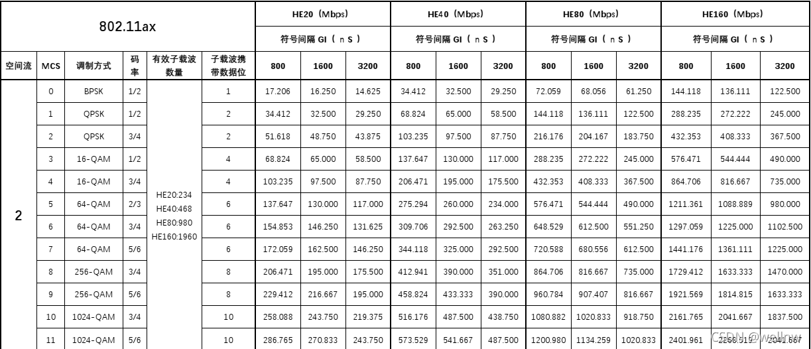
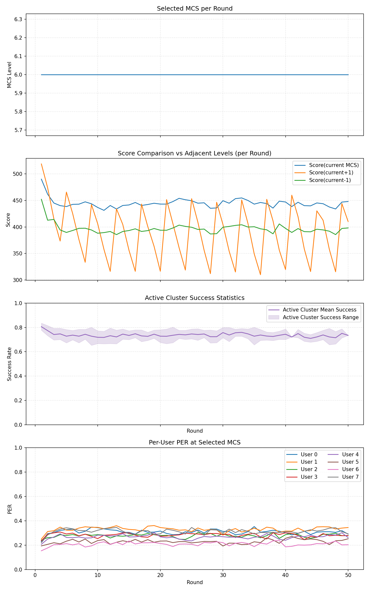

## MCS 组播调控算法（Minstrel-like + 聚类）

### 1. 目标
- **目标**：在 2–8 用户的组播场景下，依据每用户 ACK 推断 PER，按簇聚合得到“代表性成功率”，忽略/降权离群者/簇，选择收益最大且稳定的组播 MCS。

### 2. 场景与假设
- 每轮传输结束，收集每个用户是否成功接收（ACK/NAK）。
- 链路条件可随时间变化，可能出现离群用户或突然离开。
- 初始化：`default_mcs = 6`

### 3. 主要思路
- **聚类与稳健化**：基于每个用户在锚定档位`m_curr`的成功率 EWMA `s[i][m_curr]`，采用一维聚类方法将用户划分为簇，仅利用“活跃簇”的代表性成功率参与决策，从而避免少量表现差的用户影响整体选择。
- **Minstrel 思路**：持续 EWMA 更新、吞吐评分、带约束的选择、防抖与周期性探索。
- **无样本衰减**：对当轮未尝试的 MCS，将对应成功率进行轻度衰减。

### 4. 变量与符号
- 索引与集合：
  - `i`：用户索引，$i \in \{1..N\}$；`N`：用户总数
  - `m`：MCS 档位索引，$m \in \text{MCS\_TABLE}$；`MCS_TABLE`：可用 MCS 集合（802.11ax WiFi6 {0..11}）
  - `users`：用户集合；`clusters`：聚类后的簇集合；`c`：某一簇；`C_active`：活跃簇集合

- 基本统计量（逐用户/逐 MCS）：
  - `attempt[i][m]`：对用户 `i` 在档位 `m` 的尝试次数
  - `success[i][m]`：对应成功次数
  - `round_succ_main`：主簇在当前轮的滚动成功率（用于突发降档）

- 成功率估计：
  - $s[i][m] \in [0,1]$：用户 `i` 在 `m` 的 EWMA 成功率
  - `Q80(·)`：80% 分位数；`mean(·)`：平均值
  - $S_c[m]$：簇 `c` 在 `m` 的代表成功率（如 $0.7 \cdot Q80 + 0.3 \cdot \text{mean}$）
  - `samples_ok(m, n_min)`：档位 `m` 的样本量是否达到阈值 `n_min`
  - `sustained(m, k)`：候选条件是否已连续满足 `k` 轮

- 评分与探索：
  - `R[m]`：档位 `m` 的净吞吐
  $\text{Score}[m] = R[m] \cdot \sum_{c\in C_{\text{active}}} w_c \cdot (S_c[m])^{\gamma}$：档位评分
  <!-- - $\text{UCB}[m] = \text{Score}[m] + c \cdot \sqrt{\frac{\ln(T)}{n_m}}$：探索上界评分；`c`：UCB 系数；`T`：累计探索步；`n_m`：档位 `m` 已探索次数 -->
  - $w_c$：簇权重，$w_c \propto |c|^{\beta} \cdot \text{priority}_c$，归一化后 $\sum w_c = 1$；`priority_c`：簇优先级（默认 1）


- 控制状态与决策：
  - `m_curr`：当前使用的 MCS
  - `hold_counter`：保持计数（用于防抖）
  - `m_safe_low`：保底档位（稳妥低 MCS）
  - `default_mcs`：初始档位（默认 6）
  - $c^*$：活跃簇中规模最大的主簇（若有两簇规模相同，选簇代表成功率较低的簇）
  - `K_clusters`：k-means++ 的簇数（2 或 3）

- 时间与衰减：
  - `Δt`：统计更新的时间间隔
  - `α`（`ALPHA`）：EWMA 对 `s` 的遗忘因子

- 阈值与超参：
  - $\zeta$（`ZETA`）：活跃簇规模占比下限；$\beta$（`BETA`）：簇权重幂；$\gamma$（`GAMMA`）：评分幂
  - `Δ_up`：升档收益增益阈值；`Δ_down`：降档收益增益阈值
  - `HOLD_TIME_UP`：升档连续满足轮数；`HOLD_TIME_DOWN`：降档连续满足轮数
  - `EXPLORE_RATIO`：探索占比
-
  - `n_min`：升档最小样本需求
  
<!-- `θ_drop`：突发降档的滚动成功率阈值； -->
- 调度与计划：
  - `K_total`：本轮总发送数；`K_explore`：探索发送数；`K_main`：主用发送数
  - `plan`：当轮发送计划；`explore_set`：探索档位集合

- 固定设定与外部常量：
  - `BW`：带宽（默认 `80MHz`）；`NSS`：空间流数（默认 `2`）
  - `prior(m)`：样本不足时对 `S_c[m]` 的先验估计（如递减到 0.6）

### 5. 统计与估计
- EWMA 更新：
  - 若近期窗口成功率 \(x=\frac{\text{success}}{\text{attempt}}\)：
    - \( s[i,m] \leftarrow \alpha \cdot s[i,m] + (1-\alpha)\cdot x \)
  - 时间基准：固定更新间隔 \( \Delta t = 100\text{ms} \)。

- 无样本衰减：若当轮 `attempt[i][m] == 0`，则对该统计执行轻度衰减：
  - \( s[i,m] \leftarrow \rho\cdot s[i,m] \)，其中 \(0<\rho<1\)


#### 5.1 用户PER单调修正
- 目的：纠正样本稀疏/噪声导致的跨 MCS 非单调估计，使高阶成功率不高于低阶（PER 单调不下降）。

- 方法：缺失数据处理+PAV(同单回归)：
  - 缺失定义：`attempt[i][m] == 0` 
  - 前缀最高填充：对低→高 MCS，若 `s[i,m]` 缺失，则用“前缀最高值”填入：`s_pref[m] = max_{k≤m, observed} s[i,k]`（无前缀则保持缺失）。
  - PAV：对序列 `s[i,m]` 加约束 `s[m] ≥ s[m+1]`，相邻违约块合并为均值，直至整体非增。

### 6. 聚类与活跃簇选择
- 输入：一维样本向量 `s[i][m_curr]`
- 聚类方法：1D k-means++（K∈{2,3}，优先 2；当 N≥6 且存在明显中间簇时允许 3）。
  - K 选择：计算 K=2 与 K=3 的 轮廓系数，若 K=3 的相对改进 < 10% 则用 K=2。
- 活跃簇选择：仅保留规模占比 ≥ ζ 的簇进入 `C_active`；其余视为离群簇（评分不考虑）。
 - 簇权重：\( w_c \propto |c|^{\beta}\cdot \text{priority}_c \)，归一化到 Σw=1。
- 簇代表成功率：
  - \( S_c[m] = 0.7 \cdot Q80(\{s[i,m]\}) + 0.3 \cdot \text{mean}(\cdot) \)

### 7. MCS 评分与选择

#### 7.1 评分公式
- 评分（活跃簇的期望吞吐）：
  - \( \text{Score}[m] = R[m] \cdot \sum_{c\in C_{\text{active}}} w_c \cdot (S_c[m])^{\gamma} \)
- 约束与对比：
  - 以 `Score[m]` 为决策依据，无需绝对阈值，升/降均与相邻档收益比较。
- 防抖：
  - 升档需连续 `HOLD_TIME_UP` 轮判定为真；降档需连续 `HOLD_TIME_DOWN` 轮。

#### 7.2 升降阶（MCS 上下切换）
- 升阶（更高 MCS）
- 触发条件（全部满足才升）：
  - 收益比较：\( \text{Score}[m{+}1] \ge (1{+}\Delta_{up})\cdot \text{Score}[m] \)
  - 样本门槛：`m+1` 样本量 ≥ `n_min`
  - 防抖：连续 `HOLD_TIME_UP` 轮满足条件（默认2）
  - 步长： 
    - 默认 +1；
  - 若 `m+1` 统计陈旧（Δt 大或 `attempt` 少），先在探索中刷新再判断?

- 降阶（更低 MCS）
- **收益对比降阶**（步长=1）：
  - **条件**：若存在上一档 `m-1` 且 \( \text{Score}[m-1] \ge (1{+}\Delta_{down})\cdot \text{Score}[m] \)。
  - **动作**：连续 `HOLD_TIME_DOWN` 轮满足条件后，降至 `m-1`（仅降 1 档，且不低于 `m_safe_low`），并进入冷静期。
  - **目的**：完全以收益对比判断，无需依赖绝对阈值，同时约束降档步长。
  
  <!--
  - **突发保护**：
    - **统计依据**：`round_succ_main` = 当轮主簇在主用档位的瞬时成功率
      - 计算：仅统计用 `m_curr` 发送且覆盖主簇成员的组播，`round_succ_main = successes/attempts`
      - 平滑：EWMA 或 3 轮窗口均值，避免单次抖动
    - **触发条件**：`round_succ_main < θ_drop`或连续丢 ACK 超阈值
    - **降档策略**：
      - 降 1 档（如 MCS 7→6）
    - **目的**：快速响应信道恶化，避免持续的高丢包
  -->
  


<!-- - 探索与切换的关系
  - 对样本不足的更高档位，提高探索权重，直至达到 `n_min` 样本阈值 -->


### 8. 探索机制
- 发送份额：主用 MCS 占 90%，探索占 10%（与Minstrel一致）。
- 探索对象与调度：在候选 {`m_curr+1`, `m_curr+2`, `m_curr-1`, `m_curr-2`} 中按 round-robin 轮转选择可用档位。

#### Minstrel方案参考
- 启动时预生成一张随机排列表，每列是MCS_TABLE的随机序列。
- 运行时按照列顺序扫描，用完一列换下一列。
- 跳过成功率大于95%的MCS
- linux的实现中还会显示成功率小于1%的MCS最多探测两次

<!-- ### 9. 离群者与保障
- 用户级离群：若对主用 MCS 连续 L 窗 `s[i][m_curr] < θ`，标记离群（不参与聚类）。
- 保障策略：每 `RESCUE_PERIOD` 轮插入一次低 MCS 的保底发送，尝试恢复；若连续 T 次无 ACK，视为离开并暂时忽略。 -->

### 9. 参数默认值
- **EWMA**：`ALPHA=0.25`
- **聚类**：`ZETA=0.2`（簇规模下限），`BETA=1.0`（线性按人数加权）
- **评分**：`GAMMA=1.2`（偏好稳定），`R[m]` 净吞吐
- **收益阈值**：`Δ_up=0.05`，`Δ_down=0.05`
- **防抖**：`HOLD_TIME_UP=2`，`HOLD_TIME_DOWN=2`
- **探索**：`EXPLORE_RATIO=0.10`
- **样本**：`n_min=30`
- **无样本衰减**：`NO_SAMPLE_DECAY=0.85`
- **固定设定**：`BW=80MHz`，`NSS=2`，`default_mcs=6`，`m_safe_low=2`，`MCS_TABLE=0..11`。

### 11. 伪代码
```pseudo
const ALPHA=0.25, ZETA=0.2, BETA=1.0
const GAMMA=1.2, Δ_up=0.05, Δ_down=0.05
const HOLD_TIME_UP=2, HOLD_TIME_DOWN=2
const EXPLORE_RATIO=0.10, RHO_NO_SAMPLE=0.85
const n_min=30, default_mcs=6

state:
  s[i][m] ← 0.9
  attempt[i][m], success[i][m] ← 0
  m_curr ← default_mcs
  hold_counter ← 0
  bad_streak_counter ← 0
  explore_offsets ← deque([+1, +2, -1, -2])

loop each round:
  // A) 发送计划（主用+探索）
  plan ← []
  append MAIN_TX_PER_ROUND of {mcs: m_curr} to plan
  offset ← pop_left_then_push_back(explore_offsets)
  m_explore ← clip(m_curr + offset, min(MCS_TABLE), max(MCS_TABLE))
  append EXPLORE_TX_PER_ROUND of {mcs: m_explore} to plan

  // B) 执行并收集 ACK（组播到所有用户）
  for tx in plan:
    for user i in users:
      attempt[i][tx.mcs] += 1
      recv ← ack_received(i, tx) ? 1 : 0
      success[i][tx.mcs] += recv

  // C) EWMA + 无样本衰减
  for each (i,m):
    if attempts_in_this_round[i][m] > 0:
      x ← recent_window_success(i,m)
      s[i][m] ← ALPHA*s[i][m] + (1-ALPHA)*x
    else:
      s[i][m] ← RHO_NO_SAMPLE * s[i][m]

  // D) 用户级单调修正（缺失处理：前缀最高 + PAV 非增）
  for user i in users:
    // 构造前缀最高填充序列 s_pref
    s_pref[*] ← s[i][*]
    max_seen ← -inf
    for m in MCS_TABLE (ascending):
      if attempt[i][m] > 0:
        max_seen = max(max_seen, s[i][m])
        s_pref[m] = s[i][m]
      else if max_seen != -inf:
        s_pref[m] = max_seen
      // 若仍无前缀观测，可保留缺失或用保守先验（略）

    // 对 s_pref 做 PAV，得到 s_pav（非增）
    s[i][*] ← PAV_nonincreasing(s_pref[*])

  // B) 聚类与活跃簇
  // 1D k-means++ 聚类（K∈{2,3}）
  K_clusters ← choose_K_via_sse_and_silhouette(users, m_curr)
  clusters ← kmeanspp_1d(users, m_curr, K_clusters, max_iters=20)
  C_active ← { c in clusters | size(c)/N ≥ ZETA }
  normalize weights: w_c ∝ (size(c))^BETA

  // F) 簇代表成功率
  for c in C_active:
    for m in MCS_TABLE:
      vals ← { s[i][m] | i ∈ c, has_samples(i,m) }
      if vals empty: S_c[m] ← prior(m)             // e.g., decaying 0.6
      else: S_c[m] ← 0.7*quantile(vals,0.80)+0.3*mean(vals)

  // G) 评分（当前与相邻档）
  c* ← argmax_c size(c) in C_active
  curr_score ← R[m_curr] * Σ_{c∈C_active} (w_c * (S_c[m_curr])^GAMMA)
  m_next ← m_curr + 1
  if m_next ∈ MCS_TABLE:
    score_next ← R[m_next] * Σ_{c∈C_active} (w_c * (S_c[m_next])^GAMMA)
  else:
    score_next ← -inf
  m_prev ← m_curr - 1
  if m_prev ∈ MCS_TABLE:
    score_prev ← R[m_prev] * Σ_{c∈C_active} (w_c * (S_c[m_prev])^GAMMA)
  else:
    score_prev ← -inf

  // H) 升降阶决策与防抖
  // 升阶判定（步长=1）
  if m_next ∈ MCS_TABLE
       and score_next ≥ (1+Δ_up) * curr_score
       and samples_ok(m_next, n_min):
    if hold_counter ≥ HOLD_TIME_UP:
      m_curr ← m_next
      hold_counter ← 0
    else:
      hold_counter += 1
  else:
    hold_counter ← 0

  // 降阶判定（步长=1）
  if m_prev ∈ MCS_TABLE and score_prev ≠ -inf:
    if score_prev ≥ (1+Δ_down) * curr_score:
      bad_streak_counter += 1
      if bad_streak_counter ≥ HOLD_TIME_DOWN:
        m_curr ← max(m_prev, m_safe_low)
        bad_streak_counter ← 0
    else:
      bad_streak_counter ← 0
  else:
    bad_streak_counter ← 0

end loop
```

### 12. 图示（HE80, NSS=2, GI=800ns）
<p align="center">
  
</p>

<p align="center">
  
</p>


